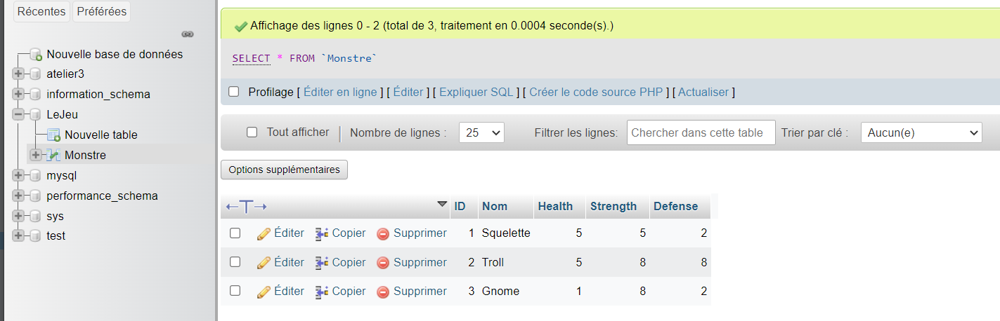
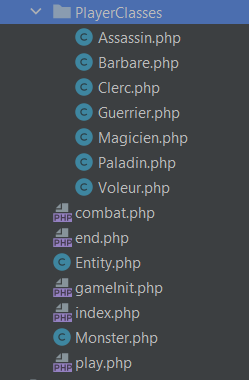

# Get et Post
Malgré qu'ils soient différents, get et post se code de la même façon. \
La valeur mis dans `name="xxxx"` (input) sera le nom de la "variable". Sa valeur sera défini avec `value="xxxx"` (input). Dans un textbox, le `value` n'est pas à écrire et sera le contenu du field. Le `value` sera utilisé par exemple lorsqu'on utilise un radio button. `name` et `value` peuvent aussi être appliqué sur un button. `method`(form) permet de choisir entre get et post. La valeur par défaut est get. Le `type="submit` (button) dans le button permet d'envoyer les infos du formulaire au click. Le `action=xxxx` permet de définir où envoyer les données (redirection)


## Get
page1.php :
```html
<form action="page2.php" method="get">
      <input name="nom">
      <button type="submit">Bouton</button>
</form>
```

page2.php :
```php
<?php
echo($_GET['nom']);
```

## Post
page1.php :
```html
<form action="page2.php" method="post">
      <input name="nom">
      <button type="submit">Bouton</button>
</form>
```

page2.php :
```php
<?php
echo($_POST['nom']);
```

### Exemple avec l'utilisation du `value`
page1.php:
```html
<p>Choisir votre classe pour le combat</p>
<form action="page2.php" method="post">
            <div class="form-check">
                <input class="form-check-input" type="radio" name="classe" id="radioGuerrier" value="Guerrier">
                <label class="form-check-label" for="radioGuerrier">Guerrier</label>
            </div>
            <div class="form-check">
                <input class="form-check-input" type="radio" name="classe" id="radioVoleur" value="Voleur">
                <label class="form-check-label" for="radioVoleur">Voleur</label>
            </div>
            <div class="form-check">
                <input class="form-check-input" type="radio" name="classe" id="radioMagicien" value="Magicien">
                <label class="form-check-label" for="radioMagicien">Magicien</label>
            </div>
            <button type="submit" class="btn btn-primary">Commencer</button>
</form>
```


# Session
`$_SESSION` permet de passer facilement des informations d'une page à une autre \
page1.php :
```php
session_start();
$unNombre = 3;
$_SESSION['leNombre'] = $unNombre;
```

page2.php :
```php
session_start();
$encoreUnNombre = $_SESSION['leNombre'];
echo($encoreUnNombre) // 3
```

# Header
Le header permet de redirigé vers un autre page. \
page1.php :
```php
header('location: page2.php');
die();
```
# BD

## Query
Une `query` est automatiquement éxécuté
```php
$query = $bd->query('SELECT * FROM role');
```
Un `prepare` nécessite un execute
````php
$query = $bd->prepare('INSERT INTO users(username, password, role_id) VALUES (?, ?, ?)');

    $query->bindValue(1, $_POST['username']);
    $query->bindValue(2, $_POST['password']);
    $query->bindValue(3, $_POST['role']);
    $query->execute();
```

## Exemple 1
Sélectionne un monstre aléatoire dans la bd et crée un instance de la classe Monster

```php
<?php
error_reporting(E_ALL);
spl_autoload_register();
session_start();
$bd = new PDO('mysql:dbname=LeJeu;host=host.docker.internal', 'root', 'root');

$query = $bd->query('SELECT * FROM Monstre');
$//query->execute();
$monsters = $query->fetchAll(PDO::FETCH_ASSOC); //rien ou FETCH_OBJ

$monster = $monsters[rand(0, count($monsters) - 1)]; // Sélection aléatoire

$monsterEntity = new Monster($monster['Nom'], $monster['Health'], $monster['Strength'], $monster['Defense']);

```

## Exemple 2
```php
<?php
$bd = new PDO('mysql:dbname=atelier3;host=host.docker.internal', 'root', 'root'); 

$query = $bd->query('SELECT * FROM role');
//$query->execute();
$roles = $query->fetchAll(PDO::FETCH_ASSOC); //rien ou FETCH_OBJ
var_dump($roles);
if(isset($_POST['username']))
{
    $query = $bd->prepare('INSERT INTO users(username, password, role_id) VALUES (?, ?, ?)');

    $query->bindValue(1, $_POST['username']);
    $query->bindValue(2, $_POST['password']);
    $query->bindValue(3, $_POST['role']);
    $query->execute();
    echo($query->rowCount());

    // Il est aussi possible de mettre dans VALUES (:username, ...) et remplacer les param par ':username'
}
?>
```
```html
        <div>
            <label for = "role">Rôle</label>
            <select name="role" id="role">
                <?php foreach ($roles as $role) { ?>
                <option value="<?= $role['id'] ?>"><?= $role['name'] ?></option>
                <?php } ?>
            </select>
        </div>
```

# Classe
Entity.php:

```php
class Entity
{
    //=================
    // VARIABLE
    //=================
    public int $health;
    public int $force;
    public int $defense;

    //=================
    // CONSTRUCTOR
    //=================
    public function __construct (?int $health = null, ?int $force = null, ?int $defense = null)
    {
        $this->health = $health ?? 10;
        $this->force = $force ?? 5;
        $this->defense = $defense ?? 5;
    }

    //=================
    // METHODS
    //=================
    public function attack (Entity $target) : void
    {
        $attackCount = 0;
        for ($i = 0; $i < $this->force; $i++)
            if(rand(1, 10) >= 6)
                $attackCount++;

        $target->defend($attackCount);
    }

    public function defend (int $attackCount, bool $bypass = false) : void
    {
        if (!$bypass)
            for ($i = 0; $i < $this->defense; $i++)
                if(rand(1, 10) >= 6)
                    $attackCount--;

        if ($attackCount > 0)
            $this->health -= $attackCount;
    }
}
```

Clerc.php :
```php
<?php
use Entity;

class Clerc extends Entity
{
    public function __construct()
    {
        parent::__construct(null, 4, 4);
    }

    public function attack (Entity $target) : void
    {
        if ($this->health < 10)
            $this->health++;
        parent::attack($target);
    }
}
```

# spl_autoload_register
```php
spl_autoload_register();
```

# Erreur
```php
declare(strict_types=1);
error_reporting(E_ALL);
```

# Print des infos pour débuguage
```php
var_dump($var);
print_r($var);
```

# Namespace
Le namespace doit être le nom du dossier où est le fichier \
 

Dans cette image, toutes les classes dans le dossier PlayerClasses doivent avoir un namespace :
```php
namespace PlayerClasses;

Class Assassin extends Entity
{
    //...
}

```