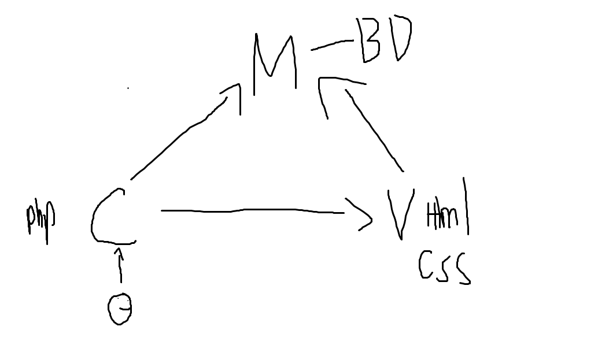

# MVC (Model View Controller)

## modèle N Tiers
Il ne faut pas de lien circulaire. \
UI -> Java -> BD \
La BD n'appelle pas le UI pour afficher un message d'erreur

## MVC
- M : Model (la BD)
- V : View (Html, css...)
- C : Controller (PHP)

### Controlleur
Utilisateur intéragi avec un controller

### Modèle
Le sql est ici
